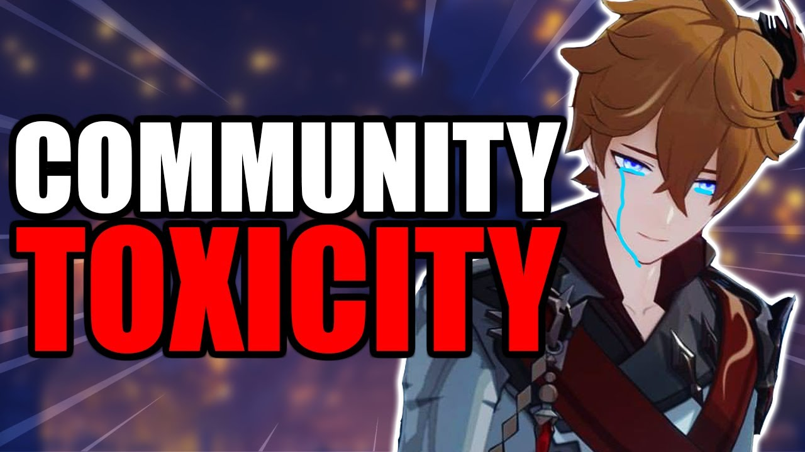

# Genshin Toxicity Social Media Report

  

## ICA 2023 Research Proposal:

- The communities that surround online gaming are heavily influenced by social toxicity. They can take on a variety of shapes both in-game and on social media. These actions may have severe adverse effects on the game's participants or even on people outside the group. Social media toxicity and its widespread presence in modern society have a significant impact that goes beyond the scope of a single game. We chose the game Genshin Impact to investigate. Despite being relatively new, this game already has a very large community and a very strong social media presence. Numerous online controversies have revolved around it, and the Genshin community has emerged.

## Peer-Reviewed Journal Articles:

> Kwak, Haewoon, and Jeremy Blackburn. “Linguistic Analysis of Toxic Behavior in an Online Video 
    Game.” Lecture Notes in Computer Science, 28 Feb. 2015, pp. 209–217., https://doi.org/10.1007/978-3-319-15168-7_26.  

> Beres, N. A., Frommel, J., Reid, E., Mandryk, R. L., & Klarkowski, M. (2021). Don’t you know that 
    you’re toxic: Normalization of toxicity in online gaming. Proceedings of the 2021 CHI Conference on Human Factors in Computing Systems. https://doi.org/10.1145/3411764.3445157 
    
> M. Märtens, S. Shen, A. Iosup and F. Kuipers, "Toxicity detection in multiplayer online games," 2015 
International Workshop on Network and Systems Support for Games (NetGames), 2015, pp. 1-6, 
https://doi.org/10.1109/NetGames.2015.7382991. 

> Guberman, J., Schmitz, C. E., & Hemphill, L. (2016). Quantifying toxicity and verbal violence on 
    Twitter. Proceedings of the 19th ACM Conference on Computer Supported Cooperative Work and Social Computing Companion - CSCW '16 Companion. https://doi.org/10.1145/2818052.2869107 

> Chakrabarty, N. (2019). A machine learning approach to comment toxicity classification. 
    Computational Intelligence in Pattern Recognition, 183–193. https://doi.org/10.1007/978-981-13-9042-5_16  

> Neto, Joaquim A., et al. “Studying Toxic Behavior Influence and Player Chat in an Online Video    
    Game.” Proceedings of the International Conference on Web Intelligence, 23 Aug. 2017, 
    https://doi.org/10.1145/3106426.3106452. 

> Furini, Marco, and Manuela Montangero. “Sentiment Analysis and Twitter: A Game Proposal.” Personal 
    and Ubiquitous Computing, vol. 22, no. 4, 25 Aug. 2018, pp. 771–785., 
    https://doi.org/10.1007/s00779-018-1142-5. 

> Krittanawong, Chayakrit, et al. “Association of Social Gaming with Well-Being (Escape Covid-19): A 
    Sentiment Analysis.” The American Journal of Medicine, vol. 135, no. 2, 1 Feb. 2022, pp. 
    254–257., https://doi.org/10.1016/j.amjmed.2021.10.010. 

> Murnion, Shane, et al. “Machine Learning and Semantic Analysis of in-Game Chat for Cyberbullying.” 
    Computers & Security, vol. 76, Mar. 2018, pp. 197–213., 
    https://doi.org/10.1016/j.cose.2018.02.016. 

> Dessì, Danilo, et al. “An Assessment of Deep Learning Models and Word Embeddings for Toxicity 
    Detection within Online Textual Comments.” Electronics, vol. 10, no. 7, 25 Mar. 2021, p. 779., 
    https://doi.org/10.3390/electronics10070779. 

## Proposed Methodology:

- Python was used to scrape and export thousands of tweets with the hashtags ***#genshinanniversary*** and ***#boycottgenshin*** into CSV files. These tweets will be categorized using sentiment analysis into the groups that we have determined the tweets reflect, which are: Positive vs. Negative, Towards Company vs. Towards Player, and Toxic vs. Non-Toxic. By categorizing the tweets, we hope to gain a better understanding of the genshin community and those connected on Social Media, in this case Twitter. We will need to work on a model that can properly separate the tweets in order to finish this categorization.

## Next Steps:

- The development of a model to classify our data, the classification of the vast number of tweets we have gathered, and finally the analysis of this data are our next main objectives. The development of the model will be the most difficult milestone because there are many factors that must be taken into account, some of which a model will find difficult to classify, such as whether or not a post is sarcastic. It will be much easier to create a training set milestone, and once it is finished, a set of randomly chosen tweets will be manually categorized and used to train the model. As we plan how to use the data that has been gathered and organized to learn more about toxicity, the last significant data analysis milestone will need to be further examined. With the help of these actions, we hope to gain a better understanding of game communities and genshin community toxicity in particular.

## Technologies Used / Planning to Use:

- Python (libraries: requests, datetime, time, argparse, pandas, langdetect) for scraping and cleaning tweet metadata from relevant hashtags into dataset

- Jupyter Notebook for training and grouping tweets into a comprehensive dataset visualization for further sentimental analysis

## Team Members:

- Jason Vu, Jessie King, Ryan Summers