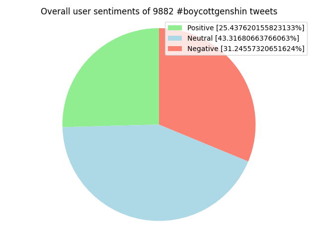

# Genshin Impact - Social Media Toxicity Report

  

## Introduction: 

- The communities that surround online gaming are heavily influenced by social toxicity. They can take on a variety of shapes both in-game and on social media. These actions may have severe adverse effects on the game's participants or even on people outside the group. Social media toxicity and its widespread presence in modern society have a significant impact that goes beyond the scope of a single game. We chose the game Genshin Impact to investigate. Despite being relatively new, this game already has a very large community and a very strong social media presence. Numerous online controversies have revolved around it, and the Genshin community has emerged.

## Proposed Methodology:

- Python was used to scrape and export thousands of tweets with some permutations of the ***#boycottgenshin*** hashtags into CSV files. These tweets will be categorized using sentiment analysis into the groups that we have determined the tweets reflect, which are: Positive, Negative, and Neutral. By categorizing the tweets, we hope to gain a better understanding of the genshin community and those connected on Social Media, in this case Twitter. We will need to work on an NLP algorithm that can properly separate the tweets in order to finish this categorization.

## Technologies Used / Planning to Use:

- Python (libraries: requests, datetime, time, argparse, pandas, langdetect, re, matplotlib, textblob) for scraping, cleaning tweet metadata, and gathering sentiment analysis from relevant hashtags into dataset

## Potential Conclusion

  

- The Genshin Impact community's reputation is not a good reflection of the true nature of the fanbase. Instead, it comes from a very loud, passionate minority whose actions kind of echo throughout the internet due to their dramatic nature. When we went through tweets, we found that there were proportionate amounts of differing opinions on the game (positive, neutral, and negative in even spread). 

- The attitude towards Genshin can generally be concluded as mixed. However, it should be noted that there is a 6% greater quantity of negative feedback compared to positive feedback so it does skew towards negative.

- One side of the community bashes the developers for a myriad of reasons, one side has nothing to do with the game, and the other aren’t necessarily “entitled” and/or “childish” as most outsiders would presume. 

- Authenticity isn’t only in the hands of developers but also is reflected in how the general community views the game. Communities adjacent to Genshin Impact are equally invested and are just as important as the primary consumers of the game.

- The overall user sentiments of the community ultimately do not come down to embody the sole opinions of bad actors. Many of these bad actors overblow the proportions of empty-handed threats and non-topical discussions.

## Next Steps:

- The development of a model to classify our data, the classification of the vast number of tweets we have gathered, and finally the analysis of this data are our next main objectives. The development of the model will be the most difficult milestone because there are many factors that must be taken into account, some of which a model will find difficult to classify, such as whether or not a post is sarcastic. It will be much easier to create a training set milestone, and once it is finished, a set of randomly chosen tweets will be manually categorized and used to train the model. As we plan how to use the data that has been gathered and organized to learn more about toxicity, the last significant data analysis milestone will need to be further examined. With the help of these actions, we hope to gain a better understanding of game communities and Genshin community toxicity in particular.

## Open Source References:

1) [asimsinian/twitter_scraper](https://github.com/asimsinan/twitter_scraper): Tweet Collection Using Twitter's Explore feature (GitHub)
2) [neeraj1909/twitter_sentimental_analysis](https://github.com/neeraj1909/twitter_sentimental_analysis): Sentimental Analysis of Tweets (GitHub fork from Medium article)
3) [Tyree Stevenson - How to analyze the sentiment of tweets](https://medium.com/@DataStevenson/how-to-analyze-the-sentiment-of-tweets-c8b5aece6962): Sentimental Analysis of Tweets (Medium article)
4) [Catris Code - Tweets Cleaning with Python](https://catriscode.com/2021/05/01/tweets-cleaning-with-python/) : Santizing Tweet Metadata
